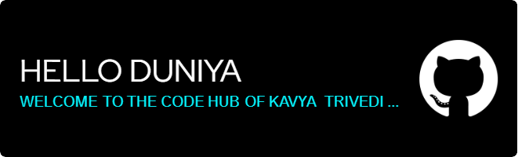

<h1 align="center">Hi 👋, I'm KAVYA TRIVEDI</h1>
<h3 align="center">A passionate creative developer from India</h3>

  

  

- 🔭 I’m currently working on **portfolio website**

- 🌱 I’m currently learning **Wordpress**

- 💬 Ask me about **Web-development**

- 📫 How to reach me **kavyatrivedi931@gmail.com**

- ⚡ Fun fact **I am creative**

<h3 align="left">Connect with me:</h3>

<h3 align="left">Languages and Tools:</h3>

        

